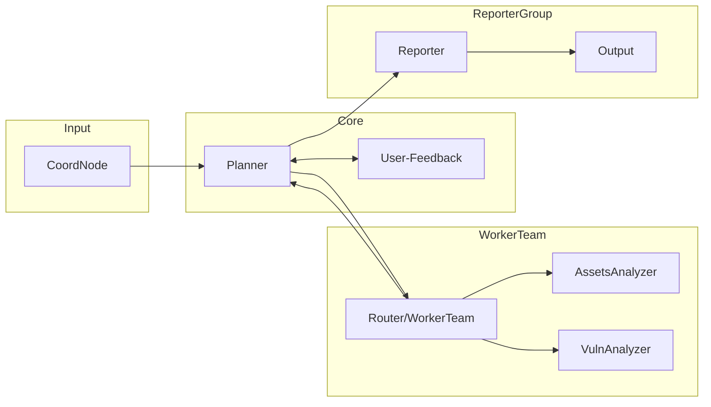

# Design
- CoordNode: read from user input or vuln scanner with json format.
- TriageNode: Read from CoordNode, and triage the input vuln to determin next step. (ignore or analysis)
- Planner: Read from TriageNode, and generate plan to analyze the vuln or assets.
- User-Feedback: From Planner, may goto Planner or goto next Node.
- WorkerTeam: Virtual Router, Recive From User-Feedback, and route to different worker or go back.
- AssetsAnalyzer: Analyze given asset to check all software dependency.
- VulnAnalyzer: Analyze given vuln. **CodeQL**.
- Reporter: Generate Jira ticket with given information.

## Graph:
CoordNode -> TriageNode -> Planner <--> User-Feedback

Planner -> WorkerTeam
Planner -> Reporter

WorkerTeam -> AssetsAnalyzer
WorkerTeam -> VulnAnalyzer
WorkerTeam -> Planner

Reporter -> Output



## Run demo webserver with uv

Prefer using `uv` to add dependencies and run the project without creating a second environment.

```bash
# Add aiohttp to dependencies (if not present)
uv add aiohttp

# Run the server using uv; this will use the environment managed by uv and will not create an extra venv
uv run python -m src.main
```

See `docs/RUN_DEMO.md` for details.

## Example
1. 给定一个资产IP，获取它的系统组件的版本号，并且使用漏洞扫描工具扫一下，获取它的基础信息。
2. 给定一个自己写的代码项目，分析它的依赖，获取依赖的版本号。
3. 获取VulnDB的信息，扫描一下所有已知资产是否有漏洞。
4. 更新并维护VulnDB的本地缓存。（暂时用不到RAG）
5. 0-Day 应急响应通告，给定一个特定的漏洞信息，扫描已y的资产。