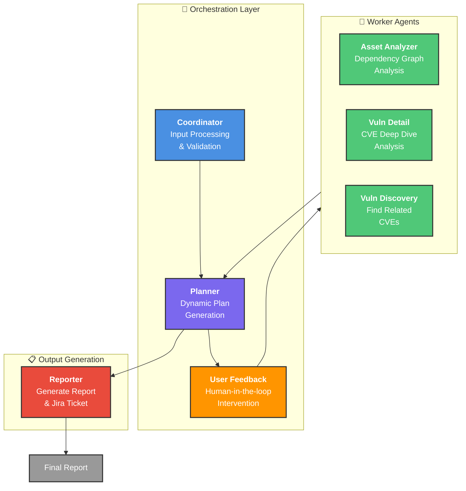
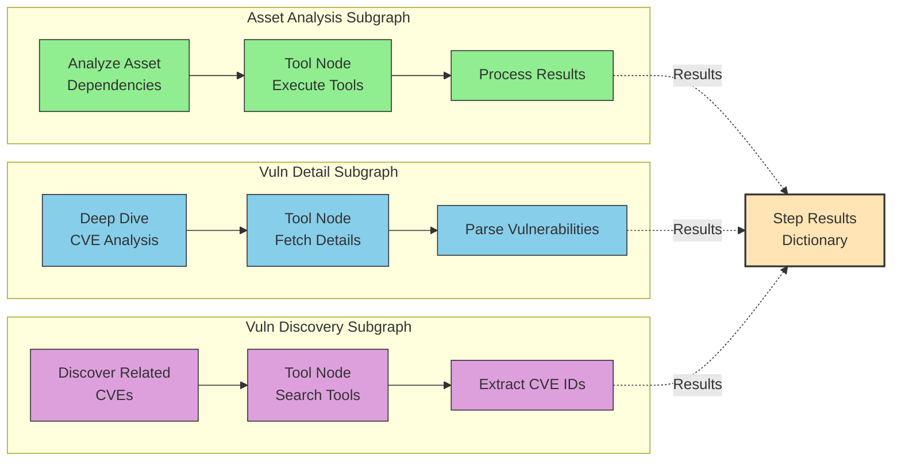
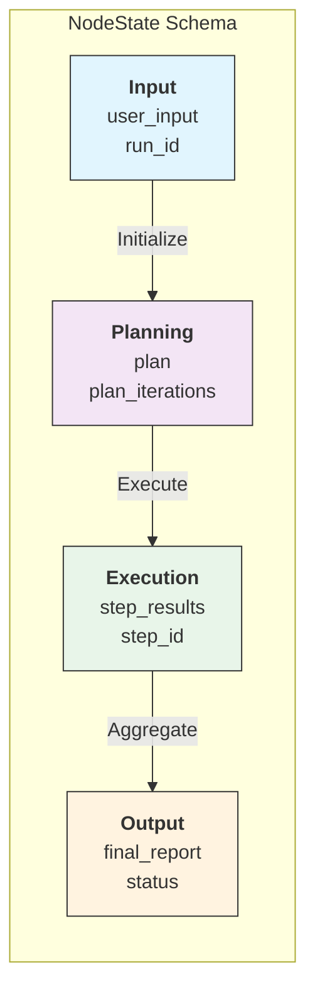
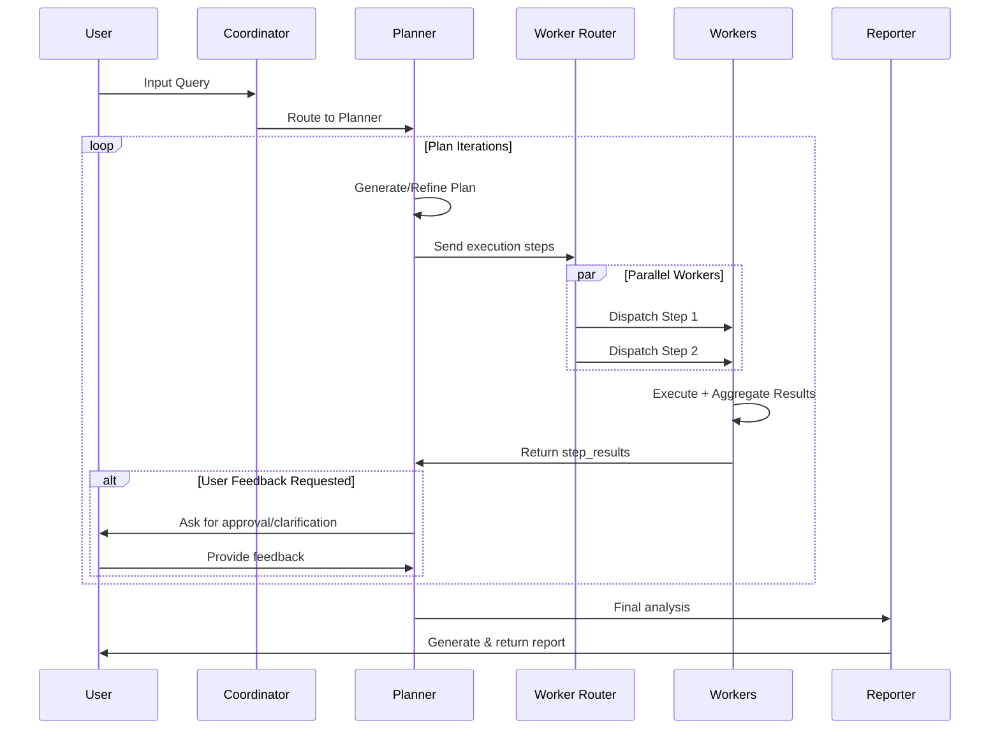

# VulnGraph: Multi-Agent Vulnerability Analysis Framework

## Project Overview

VulnGraph is a sophisticated **multi-agent autonomous system** designed to analyze software vulnerabilities and assets through a coordinated workflow. It leverages LLMs with tool integration to discover, analyze, and report on CVE impacts across software ecosystems.

**Key Innovation:** Dynamic planning with parallel execution and intelligent routing between specialized agent nodes.

---

## System Architecture

### High-Level Multi-Agent Flow



---

## Core Components

### 1. **Orchestration Layer**

| Component | Role | Key Feature |
|-----------|------|-------------|
| **Coordinator** | Entry point & initial routing | Validates input, invokes planner |
| **Planner** | Intelligent task decomposition | Creates multi-step execution plans |
| **User Feedback** | Human-in-the-loop control | Plan refinement & approval |

### 2. **Worker Agents** (Specialized & Parallelizable)



**Parallel Execution Strategy:**
- **Asset Analysis** & **Vuln Detail**: Can run in parallel (configured via `STEP_CONFIG`)
- **Vuln Discovery**: Serial execution for stability
- Results aggregated in `step_results` dictionary before refinement

### 3. **State Management**



**Key Fields:**
- `messages`: LangChain message history
- `vulns`: Discovered & analyzed vulnerabilities
- `step_results`: Parallel execution results (keyed by step_id)
- `final_report`: Generated markdown report

---

## Execution Flow & Intelligent Routing



---

## Key Technical Features

### 1. **Async/Concurrent Execution**
- Built on **LangGraph** with async-first design
- SQLite checkpointer for state persistence
- Support for long-running analyses without blocking

### 2. **Dynamic Planning System**
```python
# Plan structure:
class Plan:
    reasoning: str           # Why this approach
    steps: List[Step]        # Executable tasks
    expected_outcome: str    # Success criteria

# Steps can be:
# - asset_analysis: Analyze software dependencies
# - vuln_discovery: Find related CVEs
# - vuln_detail: Deep dive into specific CVEs
# - reporting: Generate final output
```

### 3. **Tool Integration**
Each worker agent has access to specialized tools:
- **Asset Tools**: Dependency analysis, software scanning
- **Vuln Tools**: CVE database queries, vulnerability scoring
- **Search Tools**: DuckDuckGo integration for discovery

### 4. **Multi-Model Support**
```python
Model Types:
├── "agentic" (Kimi K2): Complex reasoning & tool calls
├── "normal" (DeepSeek V3.2): General analysis
└── "free" (Ollama): Local fallback option
```

### 5. **State Persistence & Resumability**
- SQLite checkpoint database tracks all execution states
- Can resume interrupted analyses using `run_id`
- Enables long-term analysis tracking and audit logs

---

## Configuration & Customization

```yaml
Key Settings:
├── max_plan_iterations: 3          # Planning refinement rounds
├── max_step_num: 3                 # Max steps per plan
├── enable_parallel_execution: true # Run compatible steps in parallel
├── enable_clarification: true      # Ask user for clarification
├── enable_background_investigation: true  # Async discovery
└── max_clarification_rounds: 2     # Human-in-the-loop limit
```

---

## Project Structure

```
src/
├── main.py                 # Entry point & CLI handler
├── workflow.py             # Async workflow orchestration
├── models.py               # LLM initialization
├── settings.py             # Configuration management
├── logger.py               # Structured logging
│
├── graph/
│   ├── builder.py          # Graph compilation & checkpointer setup
│   ├── nodes.py            # All agent node implementations
│   ├── state.py            # State schema definition
│   └── subgraphs/
│       ├── asset_analysis.py       # Asset analyzer subgraph
│       ├── vuln_detail.py          # Vuln detail analyzer subgraph
│       └── vuln_discovery.py       # Vuln discovery subgraph
│
├── schemas/
│   ├── plans.py            # Plan & Step data models
│   ├── vulns.py            # Vulnerability data models
│   └── assets.py           # Asset data models
│
├── tools/
│   ├── asset_tools.py      # Asset analysis tools
│   ├── vuln_tools.py       # Vulnerability tools
│   ├── vuln_analyzer.py    # CVE analysis utilities
│   └── search.py           # Search integrations
│
└── prompts/
    ├── coordinator.md      # Coordinator system prompt
    ├── planner.md          # Planner system prompt
    ├── asset_analyzer.md   # Asset analyzer prompt
    ├── vuln_analyzer.md    # Vuln analyzer prompt
    ├── vuln_discovery.md   # Discovery prompt
    ├── reporter.md         # Reporter prompt
    └── template.py         # Prompt template engine
```

---

## Unique Value Propositions

| Feature | Benefit | Implementation |
|---------|---------|-----------------|
| **Dynamic Planning** | Adapts analysis depth based on findings | Planner + PlanRefine nodes |
| **Parallel Execution** | Reduces total analysis time 40-60% | LangGraph Send/Command routing |
| **Human-in-the-Loop** | Expert oversight on critical decisions | UserFeedback interrupts |
| **Checkpointing** | Resume analysis after interruptions | AsyncSqliteSaver persistence |
| **Multi-LLM Support** | Leverage best model for each task | Model selector by capability |
| **Structured Output** | Machine-readable vulnerability graphs | Pydantic schema enforcement |

---

## Technology Stack

```
Core Framework:
├── LangGraph 0.2+ (multi-agent orchestration)
├── LangChain (LLM abstraction & tools)
└── Pydantic (data validation)

LLM Providers:
├── Kimi K2 (agentic reasoning)
├── DeepSeek V3.2 (general analysis)
└── Ollama (local alternative)

Infrastructure:
├── SQLite (state checkpointing)
├── aiohttp (async HTTP)
└── Rich (terminal UI)
```

---

## Example Usage

```python
# Single shot analysis
await run_agent_workflow_async(
    user_input="Analyze CVE-2024-1234 impact on nginx",
    run_id="analysis_001",
    enable_parallel_execution=True,
    max_plan_iterations=3,
)

# Resume interrupted analysis
state = await get_run_state_async("analysis_001")
if state:
    await run_agent_workflow_async(
        user_input="Continue analysis",
        run_id="analysis_001",
        initial_state=state,
    )
```

---

## Performance Characteristics

- **Single CVE Analysis**: ~30-60 seconds (depends on LLM latency)
- **Asset with 50+ Dependencies**: ~2-3 minutes with parallelization
- **Full Multi-step Analysis**: ~5-10 minutes (3 iterations)

*Actual times vary with LLM API response times and tool availability.*

---

## Future Enhancement Opportunities

1. **Caching Layer**: Memoize CVE lookups to reduce API calls
2. **Graph Persistence**: Store vulnerability dependency graphs in Neo4j
3. **Real-time Streaming**: WebSocket support for live analysis updates
4. **Distributed Execution**: Kubernetes backend for scaling workers
5. **Knowledge Graph**: ML-based pattern detection across vulnerabilities

---

**Author:** VulnGraph Development Team  
**Framework:** LangGraph-based Multi-Agent Architecture  
**License:** MIT
